<p align="center">
  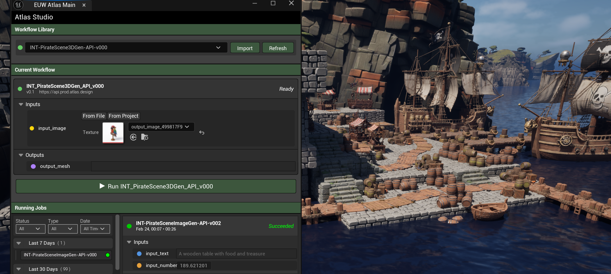
</p>

<h1 align="center">Atlas Workflow</h1>

<p align="center">
  <strong>A powerful Unreal Engine plugin for orchestrating and executing Atlas Platform workflows</strong>
</p>

<p align="center">
  
  
  
  
</p>

<p align="center">
  <a href="#-features">Features</a> •
  <a href="#-installation">Installation</a> •
  <a href="#-quick-start">Quick Start</a> •
  <a href="#-documentation">Documentation</a> •
  <a href="#-configuration">Configuration</a>
</p>

---

> ⚠️ **Early Access Notice**
> 
> This plugin is currently in **early development**. Some features may be incomplete, and you may encounter bugs. We appreciate your patience and welcome feedback via [GitHub Issues](https://github.com/Atlas-Design/AtlasPlatform_UnrealPlugin/issues).

---

## 📋 Table of Contents

- [Overview](#-overview)
- [Features](#-features)
- [Screenshots](#-screenshots)
- [Requirements](#-requirements)
- [Installation](#-installation)
- [Quick Start](#-quick-start)
- [Documentation](#-documentation)
  - [Core Concepts](#core-concepts)
  - [Blueprint API](#blueprint-api)
  - [Input Types](#input-types)
  - [Output Types](#output-types)
- [Configuration](#-configuration)
- [Troubleshooting](#-troubleshooting)
- [License](#-license)

---

## 🎯 Overview

**Atlas Workflow** is an Unreal Engine plugin that brings the power of Atlas Platform workflows directly into your development environment. Design, execute, and iterate on AI-powered asset generation pipelines without leaving the editor — and deploy them in packaged builds.

Whether you're generating textures, creating 3D models, or running complex multi-step AI pipelines, Atlas Workflow provides a seamless interface for managing your creative automation workflows.

### Why Atlas Workflow?

- **Native Unreal Integration** — Execute workflows from Editor or Runtime
- **Full Blueprint Support** — Async nodes, type-safe inputs, and easy integration
- **Runtime Ready** — Works in packaged builds, not just editor
- **Asset Pipeline Support** — Automatic import of textures (PNG) and meshes (GLB/FBX)
- **Full Job History** — Track, inspect, and replay any previous workflow execution

---

## ✨ Features

### Workflow Management
- 📁 **Workflow Assets** — Native `.uasset` workflow definitions with Content Browser support
- 🔄 **Hot-Reload Support** — Update workflow definitions without restarting the editor
- 📚 **Workflow Library** — Organize and manage multiple workflows per project

### Intelligent Input System
- 🎨 **Image Inputs** — Use project textures or external file paths
- 🧊 **Mesh Inputs** — Static meshes, skeletal meshes, or external GLB/FBX files
- 🔢 **Primitive Inputs** — Booleans, integers, floats, and strings
- 📂 **Flexible Sources** — Project assets or file system paths

### Execution & Monitoring
- ▶️ **One-Click Execution** — Run workflows from Editor UI or Blueprint
- 📊 **Live Progress Tracking** — Monitor job phases (Upload → Execute → Download)
- ⏱️ **Configurable Timeouts** — Set execution limits up to 60 minutes
- 🔔 **State Callbacks** — Respond to job state changes in Blueprint

### Job History & Results
- 📜 **Complete History** — Browse all past workflow executions
- 🔍 **Full Inspection** — View exact inputs and outputs for any historical job
- 💾 **Persistent Storage** — Job history survives editor restarts
- 📥 **Asset Import** — Import generated assets directly into Content Browser

### Runtime Support
- 🎮 **Packaged Builds** — Execute workflows in shipping games
- 🔧 **Game Instance Subsystem** — Automatic lifecycle management
- 📡 **Async Blueprint Nodes** — Non-blocking execution with callbacks

---

## 📸 Screenshots

<p align="center">
  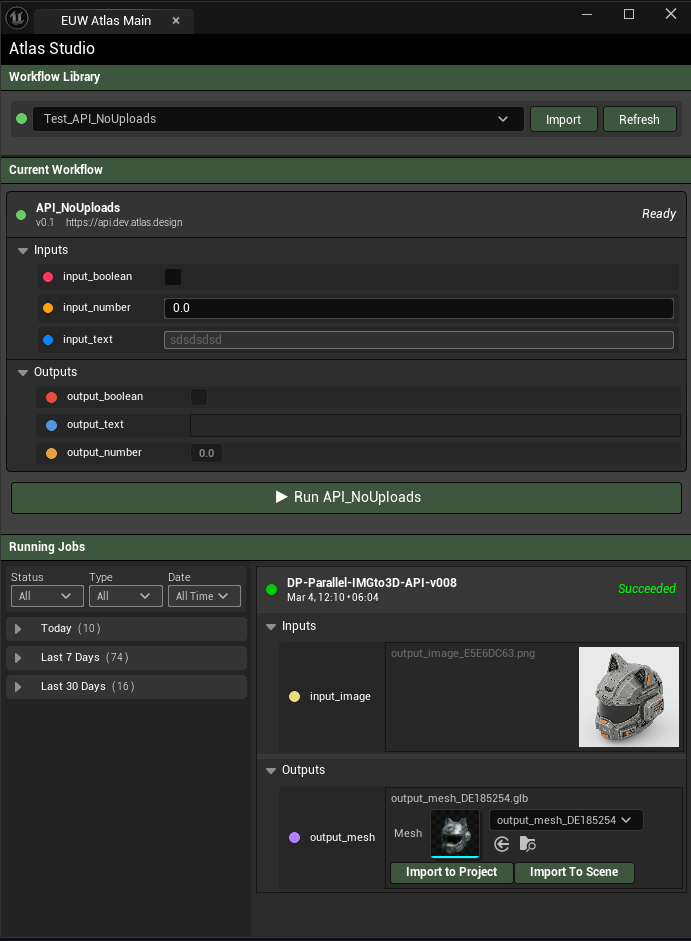
  <br/>
  <em>Main Editor Window — Load workflows, configure inputs, and execute</em>
</p>

<p align="center">
  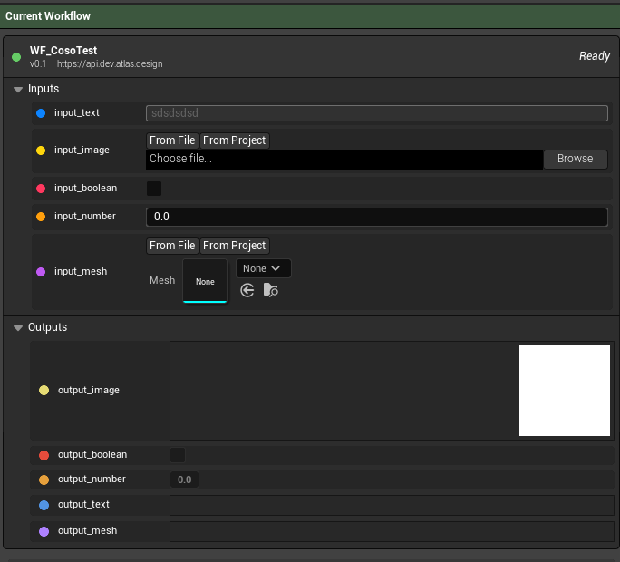
  <br/>
  <em>Type-aware input fields with project asset and file path support</em>
</p>

<p align="center">
  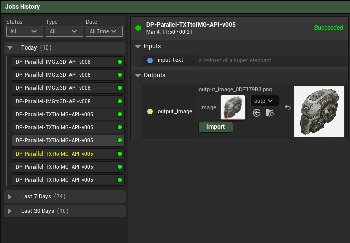
  <br/>
  <em>Job History — Browse, filter, and inspect past workflow executions</em>
</p>

<p align="center">
  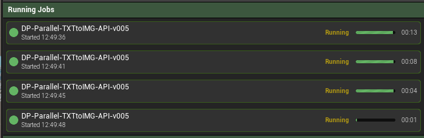
  <br/>
  <em>Running Jobs Panel — Monitor active workflow executions</em>
</p>

<p align="center">
  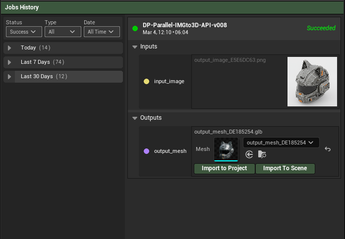
  <br/>
  <em>Completed Job — View and download generated outputs</em>
</p>

<p align="center">
  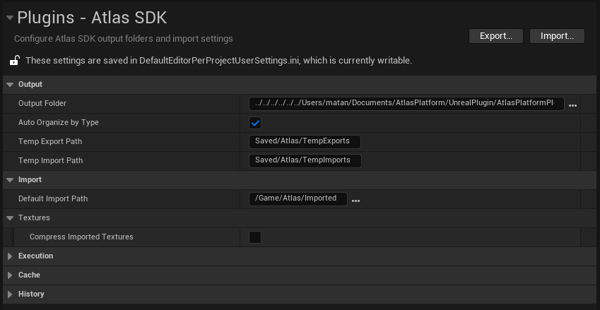
  <br/>
  <em>Editor Preferences — Configure output paths, timeouts, and caching</em>
</p>

---

## 📦 Requirements

| Requirement | Version |
|-------------|---------|
| **Unreal Engine** | 5.5 or newer |
| **Platform** | Windows (macOS/Linux untested) |

### Plugin Dependencies (Auto-enabled)

| Plugin | Purpose |
|--------|---------|
| **JsonBlueprintUtilities** | JSON parsing in Blueprints |
| **Interchange** | Mesh import (GLB/FBX) |
| **InterchangeEditor** | Editor mesh import tools |

> **Note:** An active Atlas Platform backend connection is required for workflow execution.

---

## 🚀 Installation

### Option A: Clone from GitHub (Recommended)

1. Navigate to your project's `Plugins/` folder (create it if it doesn't exist)
2. Clone the repository:

```bash
cd YourProject/Plugins
git clone https://github.com/Atlas-Design/AtlasPlatform_UnrealPlugin.git AtlasWorkflow
```

3. Regenerate project files (right-click `.uproject` → Generate Visual Studio Project Files)
4. Open your project — the plugin will compile automatically

### Option B: Download ZIP

1. Download the latest release from [GitHub Releases](https://github.com/Atlas-Design/AtlasPlatform_UnrealPlugin/releases)
2. Extract to `YourProject/Plugins/AtlasWorkflow/`
3. Regenerate project files and open your project

### Verifying Installation

After installation, you should see:
- **Window → Atlas → Atlas Workflow** menu item
- **Edit → Editor Preferences → Plugins → Atlas SDK** settings section
- **AtlasWorkflow Content** folder in Content Browser

<p align="center">
  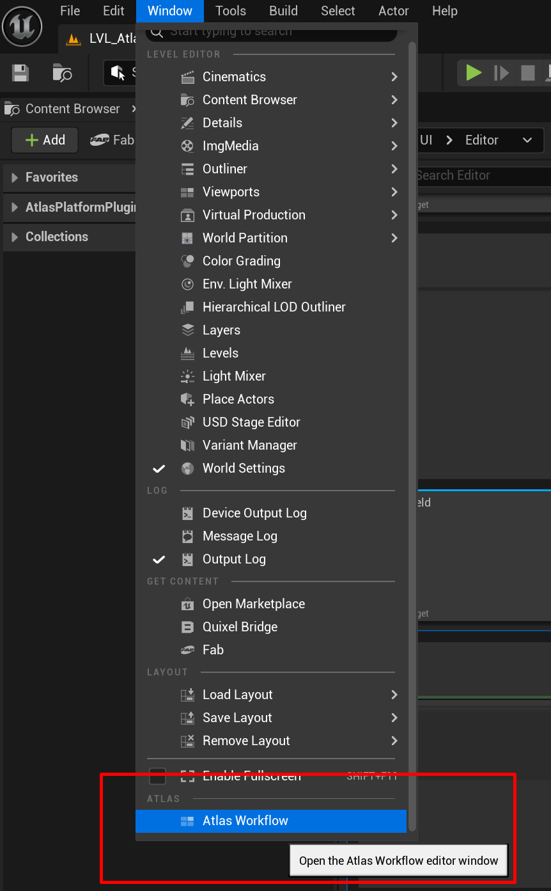
  <br/>
  <em>Access Atlas Workflow from the Window menu</em>
</p>

---

## 🏃 Quick Start

### Editor Usage

#### Step 1: Open the Editor Window

Navigate to **Window → Atlas Workflow** to open the main editor window.

#### Step 2: Configure Settings

Go to **Edit → Editor Preferences → Plugins → Atlas SDK** and configure:

- **Output Folder** — Where downloaded files are saved
- **Default Import Path** — Content Browser location for imported assets
- **Request Timeout** — Maximum time for API requests

#### Step 3: Import a Workflow

1. Open the Atlas Workflow window via **Window → Atlas → Atlas Workflow**
2. Click the **Import** button in the Workflow Library panel
3. Select a workflow JSON file exported from the Atlas Platform
4. The workflow will appear in your library and be ready to use

<p align="center">
  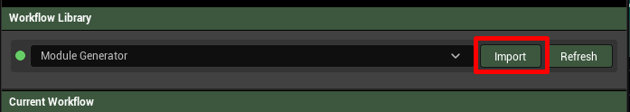
  <br/>
  <em>Import workflows using the Import button — select JSON files from the Atlas Platform</em>
</p>

<p align="center">
  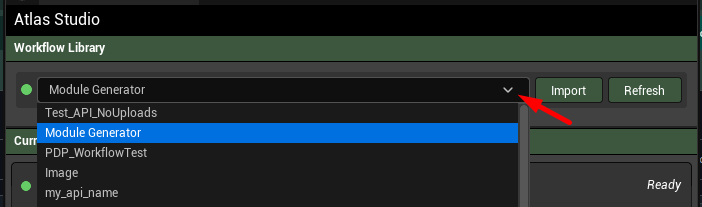
  <br/>
  <em>Imported workflows appear in the Workflow Library dropdown</em>
</p>

#### Step 4: Configure and Execute

1. Select the imported workflow from the dropdown
2. Configure input values using the input panel (choose between "From File" or "From Project" for assets)
3. Click **Run [Workflow Name]** to execute
4. Monitor progress in the Running Jobs panel

---

### Blueprint Usage

For runtime workflow execution in Blueprints, use the **Execute Atlas Workflow** async node. This handles the complete execution flow including file uploads, polling, and result downloads.

<p align="center">
  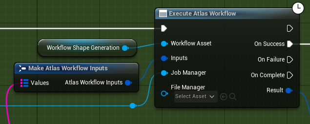
  <br/>
  <em>Execute Atlas Workflow — Async node with success/failure callbacks</em>
</p>

---

## 📖 Documentation

### Core Concepts

#### Workflow Asset

A **Workflow Asset** (`UAtlasWorkflowAsset`) is a native Unreal asset that defines:
- **API Endpoint** — Where to send execution requests
- **Inputs** — Parameters required to execute the workflow
- **Outputs** — Results produced by the workflow

Workflow assets are created by importing JSON workflow definitions via the **Import** button in the Atlas Workflow editor window. The JSON schema is exported from the Atlas Platform.

#### Job

A **Job** (`UAtlasJob`) represents a single execution of a workflow:

| Property | Description |
|----------|-------------|
| `JobId` | Unique identifier (GUID) |
| `State` | Pending, Running, Completed, Failed, or Cancelled |
| `Phase` | Initializing, Uploading, Executing, Downloading, or Done |
| `Inputs` | Frozen copy of input values at execution time |
| `Outputs` | Generated output values (after completion) |
| `Error` | Error details (if failed) |

#### Job States

```
Pending → Running → Completed
              ↓
           Failed
              ↓
          Cancelled
```

#### Job Phases (while Running)

```
Initializing → Uploading → Executing → Downloading → Done
```

---

### Blueprint API

#### Async Nodes

| Node | Description |
|------|-------------|
| **Execute Atlas Workflow** | High-level async execution with callbacks |

#### Runtime Subsystem Functions

| Function | Description |
|----------|-------------|
| `Get Atlas Runtime Subsystem` | Get the subsystem from any world context |
| `Create Job` | Create a job from workflow asset + inputs |
| `Get Active Jobs` | Get all currently running jobs |
| `Cancel All Jobs` | Stop all active executions |
| `Has Running Jobs` | Check if any jobs are running |

#### Input Functions (FAtlasWorkflowInputs)

| Function | Description |
|----------|-------------|
| `Set String` | Set a text input |
| `Set Number` | Set a float input |
| `Set Integer` | Set an integer input |
| `Set Bool` | Set a boolean input |
| `Set Image` | Set an image from file path |
| `Set Mesh` | Set a mesh from file path |

---

### Input Types

| Type | Blueprint | C++ Setter | Value |
|------|-----------|------------|-------|
| `string` | String | `SetString()` | Text value |
| `number` | Float | `SetNumber()` | Floating point |
| `integer` | Integer | `SetInteger()` | Whole number |
| `boolean` | Bool | `SetBool()` | True/False |
| `image` | File Path | `SetImage()` | PNG/JPG file |
| `mesh` | File Path | `SetMesh()` | GLB/FBX file |
| `json` | String | `SetJson()` | JSON string |

---

### Output Types

| Type | Result | Access Method |
|------|--------|---------------|
| `string` | Text | `GetString()` |
| `number` | Float | `GetNumber()` |
| `integer` | Integer | `GetInteger()` |
| `boolean` | Bool | `GetBool()` |
| `image` | File bytes | `GetFileData()` |
| `mesh` | File bytes | `GetFileData()` |
| `json` | JSON string | `GetJson()` |

---

## ⚙️ Configuration

Access settings via **Edit → Editor Preferences → Plugins → Atlas SDK**

### Output Settings

| Setting | Default | Description |
|---------|---------|-------------|
| **Output Folder** | `{Project}/Saved/Atlas/Output/` | Where downloaded files are saved |
| **Auto Organize by Type** | Enabled | Sort into Images/ and Meshes/ subfolders |

### Import Settings

| Setting | Default | Description |
|---------|---------|-------------|
| **Default Import Path** | `/Game/Atlas/Imported` | Content Browser import location |
| **Compress Imported Textures** | Disabled | Apply compression to imported textures |

### Execution Settings

| Setting | Default | Range | Description |
|---------|---------|-------|-------------|
| **Request Timeout** | 120s | 10-600s | HTTP request timeout |
| **Status Poll Interval** | 2s | 0.5-30s | How often to check job status |
| **Max Execution Time** | 600s | 30-3600s | Maximum job duration |

### Cache Settings

| Setting | Default | Description |
|---------|---------|-------------|
| **Enable Upload Cache** | Enabled | Skip re-uploading identical files |
| **Max Cache Entries** | 100 | Number of cached file IDs |
| **Cache Max Age** | 24 hours | When cache entries expire |

### History Settings

| Setting | Default | Description |
|---------|---------|-------------|
| **Max History Per Workflow** | 100 | Records kept per workflow (0 = unlimited) |
| **Auto Save Output Files** | Enabled | Automatically save downloaded files |

---

## 🔧 Troubleshooting

### Common Issues

#### "Workflow execution timed out"

**Possible causes:**
- Network connectivity issues
- Server taking longer than expected
- Timeout set too low

**Solutions:**
1. Check your internet connection
2. Increase **Max Execution Time** in Editor Preferences
3. Check Atlas Platform status

#### "Failed to upload input file"

**Possible causes:**
- File doesn't exist at specified path
- File is locked by another process
- Network issues during upload

**Solutions:**
1. Verify file path is correct
2. Close any programs using the file
3. Check **Request Timeout** setting

#### "Plugin not appearing in menus"

**Possible causes:**
- Plugin not compiled
- Missing dependencies

**Solutions:**
1. Regenerate project files
2. Rebuild project from IDE
3. Check Output Log for compilation errors

#### "Jobs not persisting after restart"

**Possible causes:**
- History folder permissions
- Corrupted history files

**Solutions:**
1. Check `Saved/Atlas/History/` folder exists and is writable
2. Delete corrupted `.json` files if present

### Enable Verbose Logging

Add to `DefaultEngine.ini`:

```ini
[Core.Log]
LogAtlas=Verbose
LogAtlasHTTP=Verbose
```

---

## 📄 License

This project is licensed under the **MIT License** — see the [LICENSE](LICENSE) file for details.

```
MIT License

Copyright (c) 2026 Atlas

Permission is hereby granted, free of charge, to any person obtaining a copy
of this software and associated documentation files (the "Software"), to deal
in the Software without restriction, including without limitation the rights
to use, copy, modify, merge, publish, distribute, sublicense, and/or sell
copies of the Software...
```

---

<p align="center">
  <strong>Built with ❤️ by the Atlas Team</strong>
</p>
