<p align="center">
  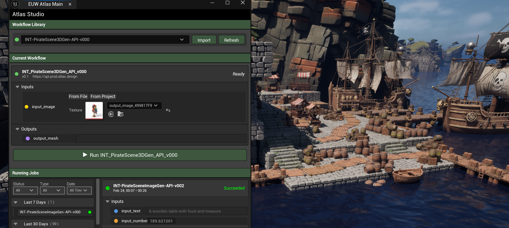
</p>

<h1 align="center">Atlas Workflow</h1>

<p align="center">
  <strong>A powerful Unreal Engine plugin for orchestrating and executing Atlas Platform workflows</strong>
</p>

<p align="center">
  
  
  
  
</p>

<p align="center">
  <a href="#-features">Features</a> •
  <a href="#-installation">Installation</a> •
  <a href="#-quick-start">Quick Start</a> •
  <a href="#-documentation">Documentation</a> •
  <a href="#-configuration">Configuration</a>
</p>

---

> ⚠️ **Early Access Notice**
> 
> This plugin is currently in **early development**. Some features may be incomplete, and you may encounter bugs. We appreciate your patience and welcome feedback via [GitHub Issues](https://github.com/Atlas-Design/AtlasPlatform_UnrealPlugin/issues).

> 🔧 **C++ project required**
> 
> The GitHub repo ships **plugin source only** (no prebuilt binaries). Your Unreal project must be **C++-enabled** so the plugin can be compiled once before use.
> 
> **Blueprint-only projects cannot compile this plugin from the editor.** If you open the project and click **Yes** on the *Missing AtlasWorkflow Modules* dialog, you may see *Engine modules are out of date… build through your IDE*.
> 
> Use an existing **C++ project**, or convert once: **Tools → New C++ Class** → close the editor → generate Visual Studio project files → build **Development Editor** → reopen the project.
> 
> **Windows build tools:** [Visual Studio 2022](https://visualstudio.microsoft.com/) with the **Game development with C++** workload.

---

## 📋 Table of Contents

- [Overview](#-overview)
- [Features](#-features)
- [Screenshots](#-screenshots)
- [Requirements](#-requirements)
- [Installation](#-installation)
- [Quick Start](#-quick-start)
  - [Working with Outputs](#working-with-outputs)
  - [Blueprint Usage](#blueprint-usage)
- [Documentation](#-documentation)
  - [Core Concepts](#core-concepts)
  - [Blueprint API](#blueprint-api)
  - [Input Types](#input-types)
  - [Output Types](#output-types)
- [Configuration](#-configuration)
  - [Authentication](#authentication)
- [Troubleshooting](#-troubleshooting)
- [License](#-license)

---

## 🎯 Overview

**Atlas Workflow** is an Unreal Engine plugin that brings the power of Atlas Platform workflows directly into your development environment. Design, execute, and iterate on AI-powered asset generation pipelines without leaving the editor — and deploy them in packaged builds.

Whether you're generating textures, creating 3D models, or running complex multi-step AI pipelines, Atlas Workflow provides a seamless interface for managing your creative automation workflows.

### Why Atlas Workflow?

- **Native Unreal Integration** — Execute workflows from Editor or Runtime
- **Full Blueprint Support** — Async nodes, type-safe inputs, and easy integration
- **Runtime Ready** — Works in packaged builds, not just editor
- **Asset Pipeline Support** — Automatic import of textures (PNG) and meshes (GLB/FBX)
- **Per-run archives** — Each execution saves inputs, outputs, and metadata under your configured output folder
- **Atlas Platform API v0.2** — Workspace API key auth, multipart upload, and version-aware file URLs

---

## ✨ Features

### Workflow Management
- 📁 **Workflow Assets** — Native `.uasset` workflow definitions with Content Browser support
- 🔄 **Hot-Reload Support** — Update workflow definitions without restarting the editor
- 📚 **Workflow Library** — Organize and manage multiple workflows per project

### Intelligent Input System
- 🎨 **Image Inputs** — Use project textures or external file paths
- 🧊 **Mesh Inputs** — Static meshes, skeletal meshes, or external GLB/FBX files
- 🔢 **Primitive Inputs** — Booleans, integers, floats, and strings
- 📂 **Flexible Sources** — Project assets or file system paths

### Execution & Monitoring
- ▶️ **One-Click Execution** — Run workflows from Editor UI or Blueprint
- 📊 **Live Progress Tracking** — Monitor job phases (Upload → Execute → Download)
- ⏱️ **Configurable Timeouts** — Set execution limits up to 60 minutes
- 🔔 **State Callbacks** — Respond to job state changes in Blueprint

### Results & Archives
- 📁 **Per-run folders** — `{OutputFolder}/{WorkflowName}/{RunId}/` with `job.json`, `inputs/`, and `outputs/`
- 💾 **Persistent on disk** — Downloaded files and run metadata survive editor restarts
- 📥 **Content Browser import** — Bring generated textures and meshes into your project from the Workflow Editor

### Runtime Support
- 🎮 **Packaged Builds** — Execute workflows in shipping games
- 🔧 **Game Instance Subsystem** — Automatic lifecycle management
- 📡 **Async Blueprint Nodes** — Non-blocking execution with callbacks

---

## 📸 Screenshots

<p align="center">
  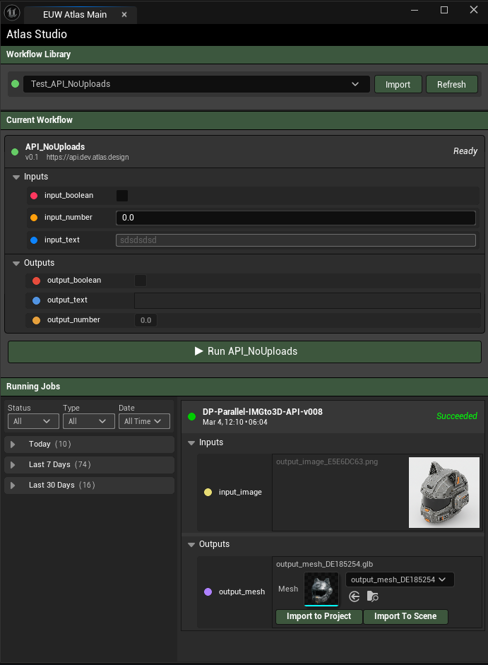
  <br/>
  <em>Main Editor Window — Load workflows, configure inputs, and execute</em>
</p>

<p align="center">
  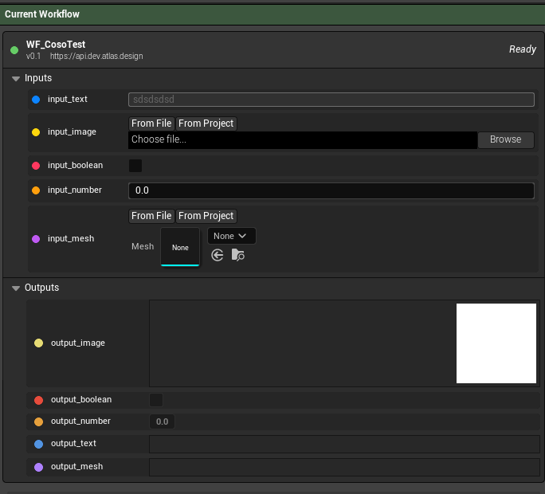
  <br/>
  <em>Type-aware input fields with project asset and file path support</em>
</p>

<p align="center">
  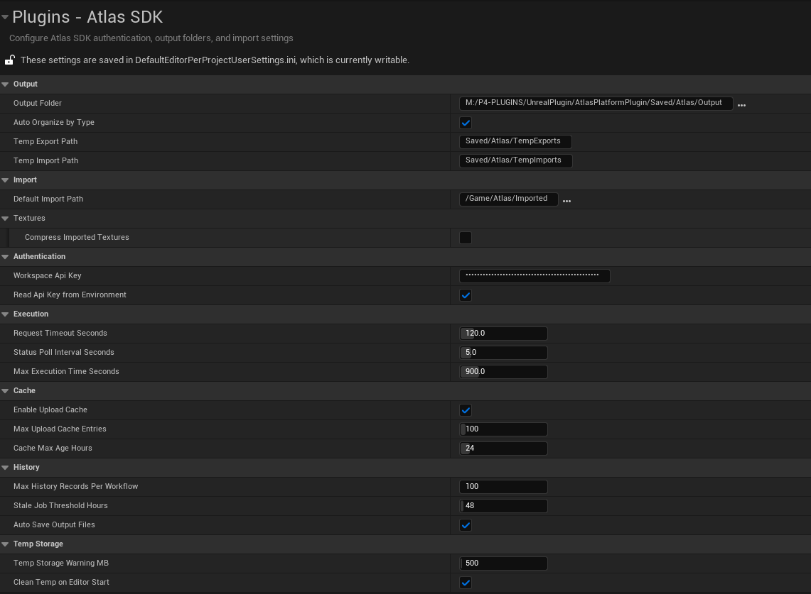
  <br/>
  <em>Editor Preferences — API key, output paths, timeouts, and caching (refresh screenshot after enabling Authentication)</em>
</p>

---

## 📦 Requirements

| Requirement | Version / notes |
|-------------|-----------------|
| **Unreal Engine** | 5.5 or newer |
| **Platform** | Windows (macOS/Linux untested) |
| **Project type** | **C++ project** (or converted once from Blueprint — see [Installation](#-installation)) |
| **Build tools (Windows)** | Visual Studio 2022 with **Game development with C++** workload |

### Plugin Dependencies (Auto-enabled)

| Plugin | Purpose |
|--------|---------|
| **JsonBlueprintUtilities** | JSON parsing in Blueprints |
| **Interchange** | Mesh import (GLB/FBX) |
| **InterchangeEditor** | Editor mesh import tools |

> **Note:** An active Atlas Platform backend connection and a **workspace API key** are required for workflow execution. Import workflow JSON exported for **API v0.2** from the Atlas Platform.

---

## 🚀 Installation

The repository does **not** include compiled `Binaries/`. The first install requires a **one-time C++ build** of the plugin inside your project.

### Clone or Download from GitHub

1. Navigate to your project's `Plugins/` folder (create it if it doesn't exist)
2. Clone the repository:

```bash
cd YourProject/Plugins
git clone https://github.com/Atlas-Design/AtlasPlatform_UnrealPlugin.git AtlasWorkflow
```

Or download and extract the repository ZIP to `YourProject/Plugins/AtlasWorkflow/`

### Build the plugin (required once)

**If your project is already C++:**

1. Right-click your `.uproject` → **Generate Visual Studio project files**
2. Open the `.sln` in Visual Studio 2022
3. Set configuration to **Development Editor** and build
4. Open the project in Unreal Editor

**If your project is Blueprint-only:**

1. Open the project in the editor
2. **Tools → New C++ Class** → choose any parent (e.g. *Actor*) → create (this adds a `Source/` folder and `.sln`)
3. Close the editor
4. Right-click the `.uproject` → **Generate Visual Studio project files**
5. Open the `.sln` and build **Development Editor**
6. Reopen the project in Unreal Editor

**If you see *Missing AtlasWorkflow Modules*:**

- Click **Yes** only if you have already completed the build steps above (C++ project with a successful IDE build)
- If you are on a Blueprint-only project and get *build through your IDE*, click **No**, follow the Blueprint-only steps above, then reopen the editor

The first build may take **several minutes**. Later editor launches are fast.

> **Note:** Prebuilt binary releases (for Blueprint-only projects without compiling) may be offered in future GitHub Releases. The default clone/ZIP install always requires building from source.

### Verifying Installation

After installation, you should see:
- **Atlas** toolbar menu (play toolbar) with **Workflow Editor**
- **Window → Atlas → Workflow Editor**
- **Edit → Editor Preferences → Plugins → Atlas SDK** (including **Authentication**)
- **AtlasWorkflow Content** folder in Content Browser

<p align="center">
  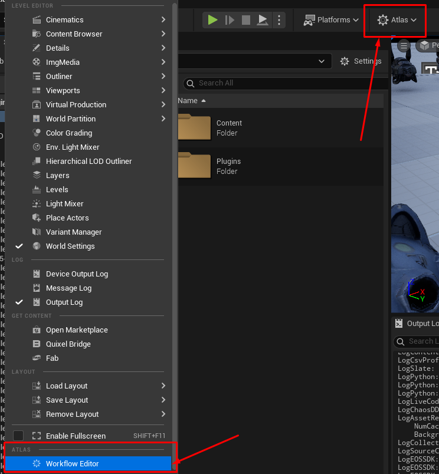
  <br/>
  <em>Access Atlas Workflow from the Window menu</em>
</p>

---

## 🏃 Quick Start

### Editor Usage

#### Step 1: Configure your API key

Go to **Edit → Editor Preferences → Plugins → Atlas SDK → Authentication** and set:

- **Workspace Api Key** — Your Atlas workspace key (`atk_...`), from **Workspace settings → API Keys** on the platform
- Or enable **Read Api Key From Environment** and set `ATLAS_API_KEY` before launching the editor (useful for CI and packaged builds)

Workflow execution fails immediately if no key is configured.

#### Step 2: Open the Workflow Editor

Use **Window → Atlas → Workflow Editor**, or the **Atlas** button on the level editor play toolbar.

#### Step 3: Configure paths (optional)

In the same settings page, adjust:

- **Output Folder** — Root for per-run job archives (`job.json`, `inputs/`, `outputs/`)
- **Default Import Path** — Content Browser location for imported assets
- **Request Timeout**, **Status Poll Interval**, **Max Execution Time** — See [Configuration](#-configuration)

#### Step 4: Import a Workflow

1. Open the Workflow Editor
2. Click the **Import** button in the Workflow Library panel
3. Select a workflow JSON file exported from the Atlas Platform
4. The workflow will appear in your library and be ready to use

<p align="center">
  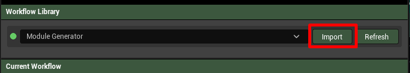
  <br/>
  <em>Import workflows using the Import button — select JSON files from the Atlas Platform</em>
</p>

<p align="center">
  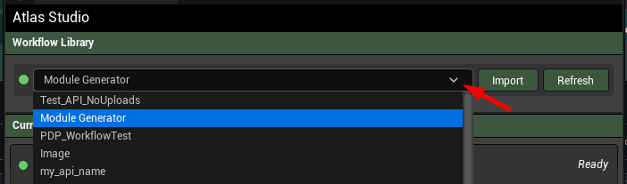
  <br/>
  <em>Imported workflows appear in the Workflow Library dropdown</em>
</p>

#### Step 5: Configure and Execute

1. Select the imported workflow from the dropdown
2. Configure input values using the input panel (choose between "From File" or "From Project" for assets)
3. Click **Run [Workflow Name]** to execute
4. Monitor progress in the Workflow Editor; completed runs write files under your **Output Folder**

---

### Working with Outputs

When a run completes, the plugin archives everything under your configured **Output Folder**:

```text
{OutputFolder}/{WorkflowName}/{RunFolder}/
  job.json
  inputs/
  outputs/
```

- **`inputs/`** — Copies of file-backed inputs used for the run  
- **`outputs/`** — Generated files from the platform  
- **`job.json`** — Run metadata (state, IDs, paths)

Use the Workflow Editor **Import** actions (or Blueprint/runtime import APIs) to bring textures and meshes into the Content Browser. Prefer import over manually copying files from `outputs/` so paths stay consistent with the plugin.

#### Content Browser layout

By default, imported assets go to:

```text
Content/Atlas/Imported/{WorkflowName}/{RunFolder}/
```

> **Blueprint migration:** If you maintain Editor Utility Widgets or graphs that manually build old flat output paths, see [`Docs/BlueprintMigrationGuide.md`](Docs/BlueprintMigrationGuide.md).

---

### Blueprint Usage

For runtime workflow execution in Blueprints, use the **Execute Atlas Workflow** async node. This handles the complete execution flow including file uploads, polling, and result downloads.

<p align="center">
  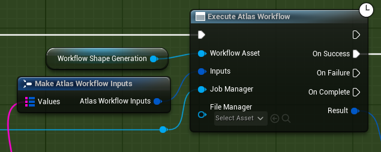
  <br/>
  <em>Execute Atlas Workflow — Async node with success/failure callbacks</em>
</p>

#### Setting Inputs

Use the input setter functions to configure workflow parameters before execution:

<p align="center">
  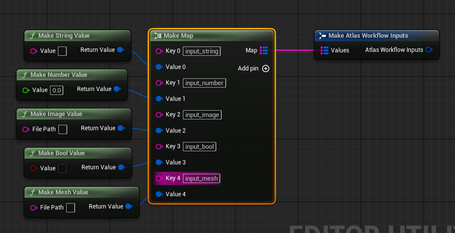
  <br/>
  <em>Setting workflow inputs — Use type-specific setters for each parameter</em>
</p>

#### Handling Outputs

Access the results from the execution result structure:

<p align="center">
  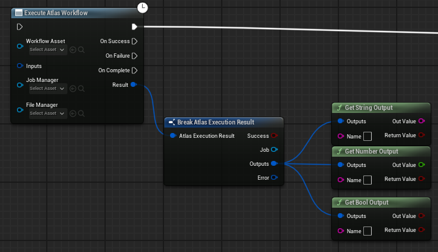
  <br/>
  <em>Accessing workflow outputs from the result</em>
</p>

<p align="center">
  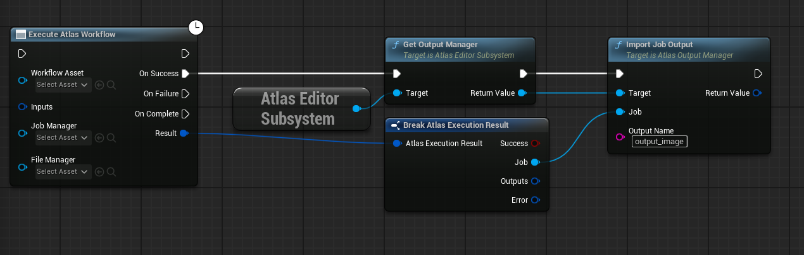
  <br/>
  <em>Handling file outputs — Save or process generated assets</em>
</p>

---

## 📖 Documentation

### Core Concepts

#### Workflow Asset

A **Workflow Asset** (`UAtlasWorkflowAsset`) is a native Unreal asset that defines:
- **API Endpoint** — Where to send execution requests
- **Inputs** — Parameters required to execute the workflow
- **Outputs** — Results produced by the workflow

Workflow assets are created by importing JSON workflow definitions via the **Import** button in the Workflow Editor. Export **API v0.2** JSON from the Atlas Platform; the asset’s `version` field drives upload/download URL shape and multipart upload behavior.

#### Job

A **Job** (`UAtlasJob`) represents a single execution of a workflow:

| Property | Description |
|----------|-------------|
| `JobId` | Unique identifier (GUID) |
| `State` | Pending, Running, Completed, Failed, or Cancelled |
| `Phase` | Initializing, Uploading, Executing, Downloading, or Done |
| `Inputs` | Frozen copy of input values at execution time |
| `Outputs` | Generated output values (after completion) |
| `Error` | Error details (if failed) |

#### Job States

```
Pending → Running → Completed
              ↓
           Failed
              ↓
          Cancelled
```

#### Job Phases (while Running)

```
Initializing → Uploading → Executing → Downloading → Done
```

---

### Blueprint API

#### Async Nodes

| Node | Description |
|------|-------------|
| **Execute Atlas Workflow** | High-level async execution with callbacks |

#### Runtime Subsystem Functions

| Function | Description |
|----------|-------------|
| `Get Atlas Runtime Subsystem` | Get the subsystem from any world context |
| `Create Job` | Create a job from workflow asset + inputs |
| `Get Active Jobs` | Get all currently running jobs |
| `Cancel All Jobs` | Stop all active executions |
| `Has Running Jobs` | Check if any jobs are running |

#### Input Functions (FAtlasWorkflowInputs)

| Function | Description |
|----------|-------------|
| `Set String` | Set a text input |
| `Set Number` | Set a float input |
| `Set Integer` | Set an integer input |
| `Set Bool` | Set a boolean input |
| `Set Image` | Set an image from file path |
| `Set Mesh` | Set a mesh from file path |

---

### Input Types

| Type | Blueprint | C++ Setter | Value |
|------|-----------|------------|-------|
| `string` | String | `SetString()` | Text value |
| `number` | Float | `SetNumber()` | Floating point |
| `integer` | Integer | `SetInteger()` | Whole number |
| `boolean` | Bool | `SetBool()` | True/False |
| `image` | File Path | `SetImage()` | PNG/JPG file |
| `mesh` | File Path | `SetMesh()` | GLB/FBX file |
| `json` | String | `SetJson()` | JSON string |

---

### Output Types

| Type | Result | Access Method |
|------|--------|---------------|
| `string` | Text | `GetString()` |
| `number` | Float | `GetNumber()` |
| `integer` | Integer | `GetInteger()` |
| `boolean` | Bool | `GetBool()` |
| `image` | File bytes | `GetFileData()` |
| `mesh` | File bytes | `GetFileData()` |
| `json` | JSON string | `GetJson()` |

---

## ⚙️ Configuration

Access settings via **Edit → Editor Preferences → Plugins → Atlas SDK**

### Authentication

| Setting | Default | Description |
|---------|---------|-------------|
| **Workspace Api Key** | *(empty)* | Bearer token for Atlas Platform (`atk_...`). Required for all workflow runs. |
| **Read Api Key From Environment** | Disabled | When the key field is empty, use `ATLAS_API_KEY` from the environment |

Keys are sent as `Authorization: Bearer <key>` on upload, execute, status, and download requests.

### Output Settings

| Setting | Default | Description |
|---------|---------|-------------|
| **Output Folder** | `{Project}/Saved/Atlas/Output/` | Root folder for per-workflow, per-run job archives |
| **Auto Organize by Type** | Enabled | Legacy flat output helper behavior; new job archives store files under each run's `outputs/` folder |

### Import Settings

| Setting | Default | Description |
|---------|---------|-------------|
| **Default Import Path** | `/Game/Atlas/Imported` | Content Browser import location |
| **Compress Imported Textures** | Disabled | Apply compression to imported textures |

### Execution Settings

| Setting | Default | Range | Description |
|---------|---------|-------|-------------|
| **Request Timeout** | 120s | 10-600s | Per-request HTTP timeout (`0` = no timeout) |
| **Status Poll Interval** | 5s | 0.5-30s | How often to poll async job status |
| **Max Execution Time** | 900s | 30-3600s | Maximum job duration before timeout |

### Cache Settings

| Setting | Default | Description |
|---------|---------|-------------|
| **Enable Upload Cache** | Enabled | Skip re-uploading identical files |
| **Max Cache Entries** | 100 | Number of cached file IDs |
| **Cache Max Age** | 24 hours | When cache entries expire |

### History Settings

| Setting | Default | Description |
|---------|---------|-------------|
| **Max History Per Workflow** | 100 | Records kept per workflow (0 = unlimited) |
| **Auto Save Output Files** | Enabled | Automatically save downloaded files |

---

## 🔧 Troubleshooting

### Common Issues

#### Missing AtlasWorkflow Modules (build through your IDE)

**Cause:** The plugin is C++ source without prebuilt binaries. Blueprint-only projects have no Visual Studio solution to compile against.

**Solutions:**
1. Confirm the plugin is at `YourProject/Plugins/AtlasWorkflow/`
2. If the project has no `Source/` folder, add a C++ class once (**Tools → New C++ Class**)
3. Close the editor, generate project files from the `.uproject`, build **Development Editor** in Visual Studio 2022
4. Reopen the project — do not rely on in-editor compile for the first install on Blueprint-only projects

#### "Configure a workspace API key" / HTTP 401 or 403

**Possible causes:**
- No API key in Editor Preferences or environment
- Invalid or revoked key
- Workflow JSON from a workspace you cannot access

**Solutions:**
1. Set **Workspace Api Key** under **Authentication**, or set `ATLAS_API_KEY` and enable **Read Api Key From Environment**
2. Create a new key in Atlas **Workspace settings → API Keys**
3. Re-import workflow JSON exported for your workspace (v0.2)

#### "Workflow execution timed out"

**Possible causes:**
- Network connectivity issues
- Server taking longer than expected
- Timeout set too low

**Solutions:**
1. Check your internet connection
2. Increase **Max Execution Time** in Editor Preferences
3. Check Atlas Platform status

#### "Failed to upload input file"

**Possible causes:**
- File doesn't exist at specified path
- File is locked by another process
- Network issues during upload

**Solutions:**
1. Verify file path is correct
2. Close any programs using the file
3. Check **Request Timeout** setting

#### "Plugin not appearing in menus"

**Possible causes:**
- Plugin not compiled (see [Missing AtlasWorkflow Modules](#missing-atlasworkflow-modules-build-through-your-ide) above)
- Missing dependencies

**Solutions:**
1. Complete the [Build the plugin](#build-the-plugin-required-once) steps
2. Regenerate project files and rebuild **Development Editor** from Visual Studio
3. Check Output Log for compilation errors

#### "Jobs not persisting after restart"

**Possible causes:**
- History folder permissions
- Corrupted history files

**Solutions:**
1. Check `Saved/Atlas/History/` folder exists and is writable
2. Delete corrupted `.json` files if present

### Enable Verbose Logging

Add to `DefaultEngine.ini`:

```ini
[Core.Log]
LogAtlas=Verbose
LogAtlasHTTP=Verbose
```

---

## 📝 Changelog

See [CHANGELOG.md](CHANGELOG.md) for release notes (including the API v0.2 migration).

---

## 📄 License

This project is licensed under the **MIT License** — see the [LICENSE](LICENSE) file for details.

```
MIT License

Copyright (c) 2026 Atlas

Permission is hereby granted, free of charge, to any person obtaining a copy
of this software and associated documentation files (the "Software"), to deal
in the Software without restriction, including without limitation the rights
to use, copy, modify, merge, publish, distribute, sublicense, and/or sell
copies of the Software...
```

---

<p align="center">
  <strong>Built with ❤️ by the Atlas Team</strong>
</p>
